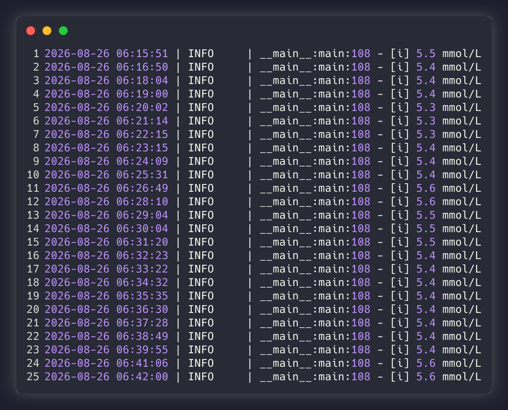

# iCan Scraper - получение данных с датчика в реальном времени

Парсер показаний датчика непрерывного мониторинга глюкозы с веб-портала iCan Review




---

## 📉 Проблема

Данные с датчика непрерывного мониторинга глюкозы существуют в закрытой экосистеме. Официальные приложения привязаны к телефону, нету публичного API и нету возможности еще как либо получить данные. А если данные нужны? Возможно своя аналитика или интеграция в свои скрипты?

Перерыл интернет и нормальных решений не нашел. Есть только вариант вручную открыть мобильное приложение

## ✅ Решение

После поиска информации был обнаружен веб-портал для медучреждений, на котором данные датчика глюкозы отображаются в реальном времени, куда я добавил себя как пациента и написал парсер который:

1. Авторизуется на портале в мой аккаунт
2. Раз в 1.5 минуты получает актуальную информацию
3. Пишет ее в `data/latest.json`, который можно читать откуда угодно

Никаких костылей, и сторонних приложений - только парсер и офф. сайт

## 📦 Что на выходе:

```json
{
  "value": "5.2",
  "unit": "mmol/L",
  "time": "08/28/2026 18:07",
  "fetched_at": "2026-08-28 18:10:19"
}
```

Файл перезаписывается атомарно: json всегда либо старый, либо новый

## 🛡️ Устойчивость — почему это не просто скрипт «на коленке»

- **Защита от блокировки** Запросы идут не циклично, а со случайным интервалом в диапазоне `MIN_SECONDS_INTERVAL`–`MAX_SECONDS_INTERVAL`. Защита от антибот-систем, рандом помогает добиться человеческого поведения

- **Отказоустойчивость** Если с сайтом чтото произошло (протухла сессия или ответил с таймаутом), то парсер понимает и после 3 неудач залогинится заново. Благодаря сохранённому профилю браузера `data/browser_profile` повторные логины случаются редко и сессия не сбрасывается при каждом перезапуске

- **Аккуратное завершение** Docker контейнер корректно реагирует на завершение - браузер закрывается и файлы не портятся, нету никаких поврежденных файлов и всегда будет целая запись

## 🚀 Быстрый старт

> [!IMPORTANT]
> Сначала зарегистрируйтесь на веб-портале iCan Review — rus.icancgm.com/review/login. Парсер логинится именно при помощи этих данных. Это отдельный сайт, а не мобильное приложение

```bash
# 1. Клонируем репозиторий
git clone https://github.com/MySelfZalin/ican-scrapper.git
cd ican-scrapper

# 2. Создаём конфиг из шаблона
cp .env.example .env
# заполняем его (см. таблицу ниже)

# 3. Собираем и запускаем контейнер
docker compose up -d --build

# 4. Смотрим логи и результат
docker compose logs -f
cat data/latest.json
```

## ⚙️ Конфигурация (`.env`)

| Переменная | Обязательная | По умолчанию | Описание |
|---|---|---|---|
| `ICAN_MAIL` | ✅ да | — | Email от аккаунта iCan Review |
| `ICAN_PASSWORD` | ✅ да | — | Пароль от аккаунта iCan Review |
| `MIN_SECONDS_INTERVAL` | нет | `60` | Минимальный интервал опроса сайта, сек |
| `MAX_SECONDS_INTERVAL` | нет | `85` | Максимальный интервал опроса сайта, сек |
| `HEADLESS` | нет | `True` | Запуск браузера в headless-режиме |

> 💡 Лучше не ставьте время опроса   меньше, чем 60 секунд, частые запросы увеличивают риск блокировки

## 🗂️ Структура проекта

```
.
├── main.py              # парсер
├── config.py            # конфигурация + чтение .env через pydantic-settings
├── requirements.txt
├── Dockerfile           # non-root образ, Playwright внутри
├── docker-compose.yml   # сервис + volume для данных
└── data/                # latest.json, scraping.log, browser_profile
```
